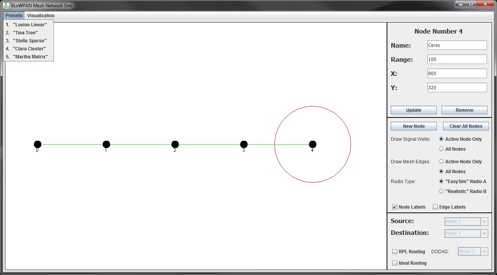

<div style="text-align:center"></div>

# About
View, edit, and """simulate""" a basic 6LoWPAN mesh network.

The program, for the most part, is to illustrate RPL routing over the mesh network, as well as be a neat demo/educational tool. It was originally written for use during a open-to-the-general-public poster fair, in which the project was to be showcased and demoed.

A live simulation showing data moving through a mesh, as well as *how* said data is being routed in the mesh was thought to make explaining the project goals/illustrating the challenges simpler.

# Manual
## Launch
The program is packaged as a standard `.jar` executable. It can be launched by simply double clicking the icon from a file explorer, or from shell, using the following command:
```
java -jar lowpan-sim.jar
```
A single CLI flag, given as `-f` *or* `--fullscreen`, enables the program to run full-screen. If the flag is not given (or the `.jar` is started from double clicking) the program will run as a windowed session by default.


## Operation
The **6LoWPAN Mesh Network Sim** window is divided into three sections: the menu bar, the lowpan node panel, and the control panel. The purpose of each section is given implicitly in the name.


### General Use
Each 6LoWPAN node is shown as a solid black circle. Each node has an associated **name**, **numerical ID**, **range**, and **XY coordinate** pair. All of this information can be seen in the upper section of the control panel. Node attributes can be edited through this section of the control panel. Note that nodes can also be removed entirely with this section of the control panel.

A node can be "selected" simply by clicking on it. In the example given, the most-right node **Ceres** was clicked, displaying its attribute information and registering it as the "selected" node. **Once a node is selected, its position can be altered by using the arrow keys**, in addition to the control panel.

All "node links" (shown as the **green lines in between nodes**) are computed in real time based on the position of the nodes, as well as their ranges. A node's range, that is, the maximum distance its simulated radio can transmit to, is given by the **red circle drawn around the node(s)**.

The middle section of the control panel modifies how the links are calculated, as well as how to display the mesh. The options are self explanatory, excluding radio type. The **Radio Type** options are defined as follows:

Radio Type | Description
-----------|------------
"EasySim" Radio A | In order for 2 nodes to be linked, the signal wells must intersect. This means the nodes **do not** need to be encompassed in each other's signal wells, only that the signal wells must intersect. This types makes setting up a desired topology much simpler.
"Realistic" Radio B | In order for 2 nodes to be linked, the signal wells of each node must encompass **both** nodes. This better models a real 6LoWPAN mesh network, as the nodes need to be able to communicate with each other (i.e. both nodes in range of each other's transmission radius) to exchange data. While more realistic, setting up a desired topology is more difficult using this mode

The **Presets** menu in the menu bar contains numerous example configurations of the simulator. It should be noted selecting a preset configuration will erase all current nodes.

### Routing
Both RPL and an idealized (least hops) routing scheme can be used on the simulator. Simply, select one or both routing types, as well as a source and destination. If RPL routing is enabled, a valid DODAG (root) node needs to be selected as well.

RPL routing is drawn source --> destination as a thick magenta line. Idealized routing is drawn similarly, but as a thinner cyan line.

The **Visualization** menu in the menu bar contains a **Show Current DODAG Tree** menu button, which allows for the current DODAG tree structure to be printed in text format in a new window. This representation *does not* automatically update as the DODAG tree changes. Indents are used to represent children of a parent, similar to a directory-style tree representation.
